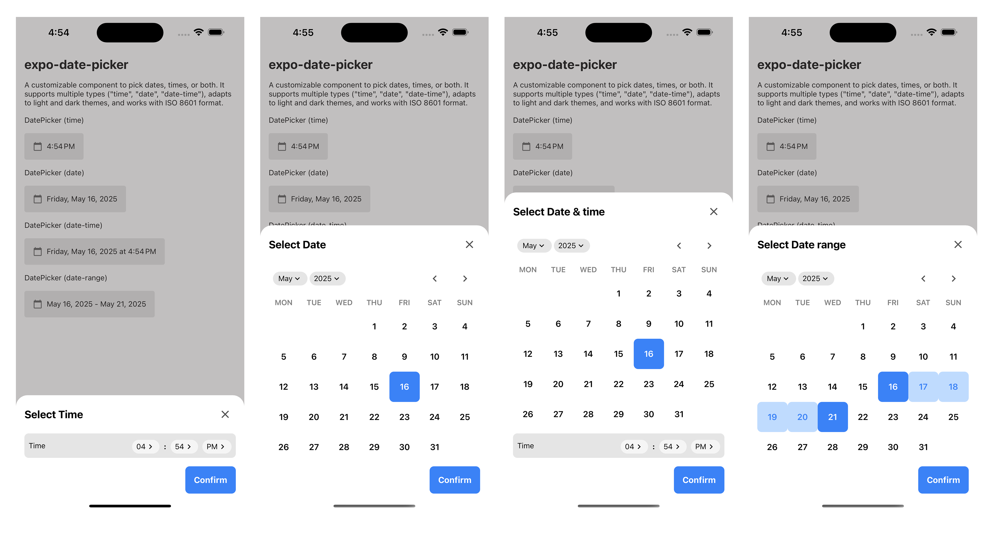

# expo-date-picker 📅

A flexible and developer-friendly date picker component for **React Native**, designed with **Expo** in mind — but **not limited to Expo**.

> ⚠️ Disclaimer: This project is **not affiliated with the official [Expo](https://expo.dev)** team or organization. The name \`expo-date-picker\` is used only to indicate that this component is compatible with Expo. You are free to use this component in any React Native project, whether managed with Expo or not.



---

## ✨ Overview

\`expo-date-picker\` is a modular and extensible date picker component designed to give developers complete control and customization. Inspired by the flexibility of projects like [shadcn/ui](https://ui.shadcn.com/), this is **not a published npm package**, but rather a copy-paste-ready component that you can adapt to your needs.

---

## 🧠 Features

- Four types of selection:
  - `date-time`
  - `date`
  - `time`
  - `date-range`
- Compatible with **Expo**
- Easy to customize
- Built with accessibility and mobile usability in mind
- Internationalization-friendly
- Lightweight and dependency-free (uses only React Native primitives and your own theme utilities)

---

## 📦 Installation

Since this is not a package, there's nothing to install.

1. Copy the \`DatePicker\` component from the repository.
2. Make sure to include any dependencies like \`Select\`, \`useChTheme\`, and constants (\`Colors\`, \`Spacing\`, etc.) or adjust to fit your own project structure.
3. Use it in your screen or component.

---

## 🚀 Usage

```tsx
import { useState } from "react";
import { View, Text, SafeAreaView, StyleSheet } from "react-native";
import { StatusBar } from "expo-status-bar";
import { DatePicker } from "@/components/DatePicker";

const today = new Date().toISOString();
const tomorrow = new Date();
tomorrow.setDate(tomorrow.getDate() + 5);
const tomorrowISO = tomorrow.toISOString();

export default function App() {
  const [date, setDate] = useState(today);
  const [dateEnd, setDateEnd] = useState<string | null>(tomorrowISO);

  return (
    <SafeAreaView style={{ flex: 1 }}>
      <View style={styles.container}>
        <Text style={styles.title}>expo-date-picker</Text>
        <Text style={styles.description}>
          A customizable component to pick dates, times, or both. It supports
          multiple types ("time", "date", "date-time"), adapts to light and dark
          themes, and works with ISO 8601 format.
        </Text>

        <StatusBar style="auto" />

        <Text>DatePicker (time)</Text>
        <DatePicker
          type="time"
          onConfirm={(e) => {
            setDate(e?.date?.toISOString());
          }}
          date={date}
        />

        <Text>DatePicker (date)</Text>
        <DatePicker
          type="date"
          onConfirm={(e) => setDate(e?.date?.toISOString())}
          date={date}
        />

        <Text>DatePicker (date-time)</Text>
        <DatePicker
          type="date-time"
          onConfirm={(e) => setDate(e?.date?.toISOString())}
          date={date}
        />

        <Text>DatePicker (date-range)</Text>
        <DatePicker
          type="date-range"
          onConfirm={(e) => {
            setDate(e?.date?.toISOString());
            setDateEnd(e?.dateEnd?.toISOString() ?? null);
          }}
          date={date}
          dateEnd={dateEnd}
        />
      </View>
    </SafeAreaView>
  );
}

const styles = StyleSheet.create({
  container: {
    flex: 1,
    alignItems: "flex-start",
    justifyContent: "flex-start",
    gap: spacing.xl,
    padding: spacing.xl,
  },
  title: {
    fontSize: 24,
    fontWeight: "bold",
  },
  description: {
    fontSize: 14,
  },
});
```

## 🎨 Customization

This component is fully editable. You can:

- Change colors and themes using your own design system
- Modify layout or animations
- Use your own icon system
- Swap or extend the \`Select\` component
- Adjust time and calendar logic as needed

---

## 🤝 Contribution Style

This is not a package. The goal is to provide something copyable, hackable, and developer-first. Just grab the code, modify it as you wish, and use it however you like.

If you'd like to contribute or suggest improvements, feel free to fork the repo and open a pull request.

---

## 📄 License

MIT — free to use, free to modify.

---

## 🙏 Acknowledgments

Built to help developers using React Native and Expo save time. Inspired by projects like [shadcn/ui](https://ui.shadcn.com/), where you own the code.
